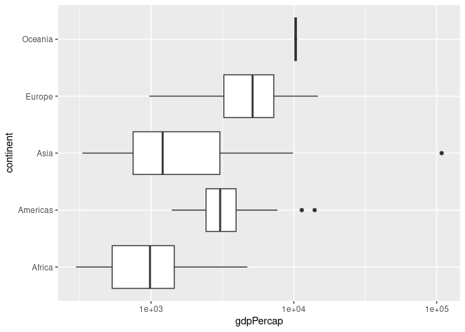
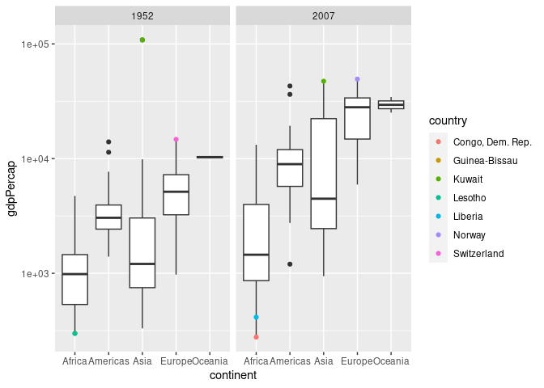
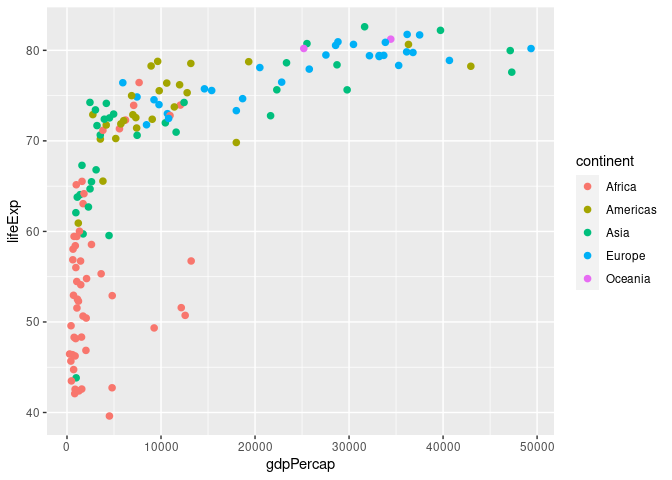
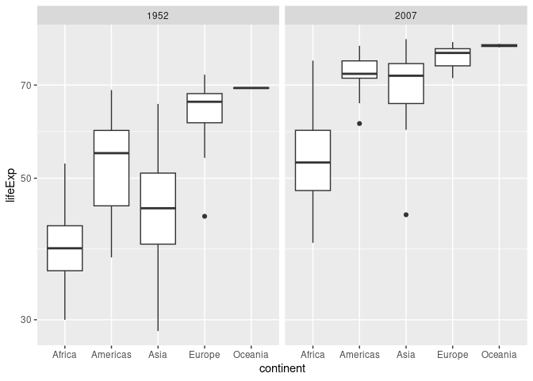
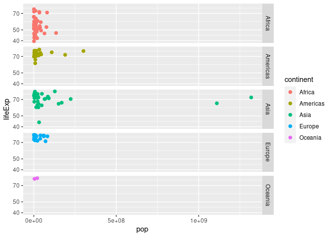

Gapminder
================
Kate McCurley
2020-

- <a href="#grading-rubric" id="toc-grading-rubric">Grading Rubric</a>
  - <a href="#individual" id="toc-individual">Individual</a>
  - <a href="#due-date" id="toc-due-date">Due Date</a>
- <a href="#guided-eda" id="toc-guided-eda">Guided EDA</a>
  - <a
    href="#q0-perform-your-first-checks-on-the-dataset-what-variables-are-in-this"
    id="toc-q0-perform-your-first-checks-on-the-dataset-what-variables-are-in-this"><strong>q0</strong>
    Perform your “first checks” on the dataset. What variables are in
    this</a>
  - <a
    href="#q1-determine-the-most-and-least-recent-years-in-the-gapminder-dataset"
    id="toc-q1-determine-the-most-and-least-recent-years-in-the-gapminder-dataset"><strong>q1</strong>
    Determine the most and least recent years in the <code>gapminder</code>
    dataset.</a>
  - <a
    href="#q2-filter-on-years-matching-year_min-and-make-a-plot-of-the-gdp-per-capita-against-continent-choose-an-appropriate-geom_-to-visualize-the-data-what-observations-can-you-make"
    id="toc-q2-filter-on-years-matching-year_min-and-make-a-plot-of-the-gdp-per-capita-against-continent-choose-an-appropriate-geom_-to-visualize-the-data-what-observations-can-you-make"><strong>q2</strong>
    Filter on years matching <code>year_min</code>, and make a plot of the
    GDP per capita against continent. Choose an appropriate
    <code>geom_</code> to visualize the data. What observations can you
    make?</a>
  - <a
    href="#q3-you-should-have-found-at-least-three-outliers-in-q2-but-possibly-many-more-identify-those-outliers-figure-out-which-countries-they-are"
    id="toc-q3-you-should-have-found-at-least-three-outliers-in-q2-but-possibly-many-more-identify-those-outliers-figure-out-which-countries-they-are"><strong>q3</strong>
    You should have found <em>at least</em> three outliers in q2 (but
    possibly many more!). Identify those outliers (figure out which
    countries they are).</a>
  - <a
    href="#q4-create-a-plot-similar-to-yours-from-q2-studying-both-year_min-and-year_max-find-a-way-to-highlight-the-outliers-from-q3-on-your-plot-in-a-way-that-lets-you-identify-which-country-is-which-compare-the-patterns-between-year_min-and-year_max"
    id="toc-q4-create-a-plot-similar-to-yours-from-q2-studying-both-year_min-and-year_max-find-a-way-to-highlight-the-outliers-from-q3-on-your-plot-in-a-way-that-lets-you-identify-which-country-is-which-compare-the-patterns-between-year_min-and-year_max"><strong>q4</strong>
    Create a plot similar to yours from q2 studying both
    <code>year_min</code> and <code>year_max</code>. Find a way to highlight
    the outliers from q3 on your plot <em>in a way that lets you identify
    which country is which</em>. Compare the patterns between
    <code>year_min</code> and <code>year_max</code>.</a>
- <a href="#your-own-eda" id="toc-your-own-eda">Your Own EDA</a>
  - <a
    href="#q5-create-at-least-three-new-figures-below-with-each-figure-try-to-pose-new-questions-about-the-data"
    id="toc-q5-create-at-least-three-new-figures-below-with-each-figure-try-to-pose-new-questions-about-the-data"><strong>q5</strong>
    Create <em>at least</em> three new figures below. With each figure, try
    to pose new questions about the data.</a>

*Purpose*: Learning to do EDA well takes practice! In this challenge
you’ll further practice EDA by first completing a guided exploration,
then by conducting your own investigation. This challenge will also give
you a chance to use the wide variety of visual tools we’ve been
learning.

<!-- include-rubric -->

# Grading Rubric

<!-- -------------------------------------------------- -->

Unlike exercises, **challenges will be graded**. The following rubrics
define how you will be graded, both on an individual and team basis.

## Individual

<!-- ------------------------- -->

| Category    | Needs Improvement                                                                                                | Satisfactory                                                                                                               |
|-------------|------------------------------------------------------------------------------------------------------------------|----------------------------------------------------------------------------------------------------------------------------|
| Effort      | Some task **q**’s left unattempted                                                                               | All task **q**’s attempted                                                                                                 |
| Observed    | Did not document observations, or observations incorrect                                                         | Documented correct observations based on analysis                                                                          |
| Supported   | Some observations not clearly supported by analysis                                                              | All observations clearly supported by analysis (table, graph, etc.)                                                        |
| Assessed    | Observations include claims not supported by the data, or reflect a level of certainty not warranted by the data | Observations are appropriately qualified by the quality & relevance of the data and (in)conclusiveness of the support      |
| Specified   | Uses the phrase “more data are necessary” without clarification                                                  | Any statement that “more data are necessary” specifies which *specific* data are needed to answer what *specific* question |
| Code Styled | Violations of the [style guide](https://style.tidyverse.org/) hinder readability                                 | Code sufficiently close to the [style guide](https://style.tidyverse.org/)                                                 |

## Due Date

<!-- ------------------------- -->

All the deliverables stated in the rubrics above are due **at midnight**
before the day of the class discussion of the challenge. See the
[Syllabus](https://docs.google.com/document/d/1qeP6DUS8Djq_A0HMllMqsSqX3a9dbcx1/edit?usp=sharing&ouid=110386251748498665069&rtpof=true&sd=true)
for more information.

``` r
library(tidyverse)
```

    ## ── Attaching packages ─────────────────────────────────────── tidyverse 1.3.2 ──
    ## ✔ ggplot2 3.4.0      ✔ purrr   1.0.1 
    ## ✔ tibble  3.1.8      ✔ dplyr   1.0.10
    ## ✔ tidyr   1.2.1      ✔ stringr 1.5.0 
    ## ✔ readr   2.1.3      ✔ forcats 0.5.2 
    ## ── Conflicts ────────────────────────────────────────── tidyverse_conflicts() ──
    ## ✖ dplyr::filter() masks stats::filter()
    ## ✖ dplyr::lag()    masks stats::lag()

``` r
library(gapminder)
```

*Background*: [Gapminder](https://www.gapminder.org/about-gapminder/) is
an independent organization that seeks to educate people about the state
of the world. They seek to counteract the worldview constructed by a
hype-driven media cycle, and promote a “fact-based worldview” by
focusing on data. The dataset we’ll study in this challenge is from
Gapminder.

# Guided EDA

<!-- -------------------------------------------------- -->

First, we’ll go through a round of *guided EDA*. Try to pay attention to
the high-level process we’re going through—after this guided round
you’ll be responsible for doing another cycle of EDA on your own!

### **q0** Perform your “first checks” on the dataset. What variables are in this

dataset?

``` r
gapminder %>%
  glimpse()
```

    ## Rows: 1,704
    ## Columns: 6
    ## $ country   <fct> "Afghanistan", "Afghanistan", "Afghanistan", "Afghanistan", …
    ## $ continent <fct> Asia, Asia, Asia, Asia, Asia, Asia, Asia, Asia, Asia, Asia, …
    ## $ year      <int> 1952, 1957, 1962, 1967, 1972, 1977, 1982, 1987, 1992, 1997, …
    ## $ lifeExp   <dbl> 28.801, 30.332, 31.997, 34.020, 36.088, 38.438, 39.854, 40.8…
    ## $ pop       <int> 8425333, 9240934, 10267083, 11537966, 13079460, 14880372, 12…
    ## $ gdpPercap <dbl> 779.4453, 820.8530, 853.1007, 836.1971, 739.9811, 786.1134, …

**Observations**:

country, continent, year, lifeExp, pop, gdpPercap

### **q1** Determine the most and least recent years in the `gapminder` dataset.

*Hint*: Use the `pull()` function to get a vector out of a tibble.
(Rather than the `$` notation of base R.)

``` r
## TASK: Find the largest and smallest values of `year` in `gapminder`
year_max <- gapminder %>%
  pull(year) %>%
  max()
year_min <- gapminder %>%
  pull(year) %>%
  min()
```

Use the following test to check your work.

``` r
## NOTE: No need to change this
assertthat::assert_that(year_max %% 7 == 5)
```

    ## [1] TRUE

``` r
assertthat::assert_that(year_max %% 3 == 0)
```

    ## [1] TRUE

``` r
assertthat::assert_that(year_min %% 7 == 6)
```

    ## [1] TRUE

``` r
assertthat::assert_that(year_min %% 3 == 2)
```

    ## [1] TRUE

``` r
if (is_tibble(year_max)) {
  print("year_max is a tibble; try using `pull()` to get a vector")
  assertthat::assert_that(False)
}

print("Nice!")
```

    ## [1] "Nice!"

### **q2** Filter on years matching `year_min`, and make a plot of the GDP per capita against continent. Choose an appropriate `geom_` to visualize the data. What observations can you make?

You may encounter difficulties in visualizing these data; if so document
your challenges and attempt to produce the most informative visual you
can.

``` r
gapminder %>%
  filter(year == year_min) %>%
  ggplot() +
  stat_boxplot(aes(continent, gdpPercap)) +
  coord_flip() +
  scale_y_log10()
```

<!-- -->

**Observations**:

- Oceania’s gdpPerCap are very similar, around 10000
- The gdpPerCap in Africa were all pretty low, less than 5000
- Asia’s gdpPerCap were all less than 10000 besides the outlier, the
  median was only a bit higher than Africa’s
- the America’s gdpPerCap also has a couple outliers above 10000

**Difficulties & Approaches**:

The challenge I had was that the extreme outlier makes the rest of the
graph very squished / difficult to read. My two thoughts to potentially
handle this were to get rid of the outlier, which I felt like I probably
wasn’t supposed to do, or to use a different scale - I used a
logarithmic scale. I still don’t know if I like this because I feel like
it’s kind of deceptive, but I don’t have a better idea. The Oceania box
is still hard to read, but I’m not sure how much I can do to fix this.

### **q3** You should have found *at least* three outliers in q2 (but possibly many more!). Identify those outliers (figure out which countries they are).

``` r
## TASK: Identify the outliers from q2
gapminder %>%
  filter(year == year_min) %>% 
  group_by(continent) %>% 
  filter(continent == "Americas") %>% 
  filter(gdpPercap > quantile(gdpPercap, 0.95))
```

    ## # A tibble: 2 × 6
    ## # Groups:   continent [1]
    ##   country       continent  year lifeExp       pop gdpPercap
    ##   <fct>         <fct>     <int>   <dbl>     <int>     <dbl>
    ## 1 Canada        Americas   1952    68.8  14785584    11367.
    ## 2 United States Americas   1952    68.4 157553000    13990.

``` r
gapminder %>%
  filter(year == year_min) %>% 
  group_by(continent) %>% 
  filter(continent == "Asia") %>% 
  filter(gdpPercap > quantile(gdpPercap, .99))
```

    ## # A tibble: 1 × 6
    ## # Groups:   continent [1]
    ##   country continent  year lifeExp    pop gdpPercap
    ##   <fct>   <fct>     <int>   <dbl>  <int>     <dbl>
    ## 1 Kuwait  Asia       1952    55.6 160000   108382.

**Observations**:

- Identify the outlier countries from q2 My graph had two outliers which
  were the two greatest values in the Americas - these are Canada and
  the US, and another outlier that was the greatest value in Asia -
  Kuwait.

*Hint*: For the next task, it’s helpful to know a ggplot trick we’ll
learn in an upcoming exercise: You can use the `data` argument inside
any `geom_*` to modify the data that will be plotted *by that geom
only*. For instance, you can use this trick to filter a set of points to
label:

``` r
## NOTE: No need to edit, use ideas from this in q4 below
gapminder %>%
  filter(year == max(year)) %>%

  ggplot(aes(continent, lifeExp)) +
  geom_boxplot() +
  geom_point(
    data = . %>% filter(country %in% c("United Kingdom", "Japan", "Zambia")),
    mapping = aes(color = country),
    size = 2
  )
```

<!-- -->

### **q4** Create a plot similar to yours from q2 studying both `year_min` and `year_max`. Find a way to highlight the outliers from q3 on your plot *in a way that lets you identify which country is which*. Compare the patterns between `year_min` and `year_max`.

*Hint*: We’ve learned a lot of different ways to show multiple
variables; think about using different aesthetics or facets.

``` r
gapminder %>%
  filter(year == max(year) | year == min(year)) %>%
  ggplot(aes(continent, gdpPercap)) +
  geom_boxplot() +
  geom_point(
    data = . %>% 
      group_by(year) %>%
      filter(
          gdpPercap < quantile(gdpPercap, 0.01) | 
          gdpPercap > quantile(gdpPercap, 0.99)
      ),
    mapping = aes(color = country)
  ) +
  scale_y_log10() +
  facet_wrap(~year)
```

<!-- -->

**Observations**:

- Kuwait is an outlier in both years
- All of the countries’ median gdpPercap increased
- There are still a few points in the boxplot from the Americas that
  aren’t counted as outliers by the scale I used
- The Oceania data is still generally pretty hard to read (fewer
  countries?, all similar?)

# Your Own EDA

<!-- -------------------------------------------------- -->

Now it’s your turn! We just went through guided EDA considering the GDP
per capita at two time points. You can continue looking at outliers,
consider different years, repeat the exercise with `lifeExp`, consider
the relationship between variables, or something else entirely.

### **q5** Create *at least* three new figures below. With each figure, try to pose new questions about the data.

``` r
gapminder %>%
  filter(year == max(year)) %>%
  ggplot(aes(gdpPercap, lifeExp)) +
  geom_point(
    mapping = aes(color = continent),
    size = 2
  )
```

<!-- -->

- Countries in Africa tend to have both the lowest gdpPercap and the
  lowest lifeExp
- There is a pretty wide range in life expectancy with the lower
  gdpPercap values, but once you get over like 5000 there is a
  consistent gradual increase

``` r
gapminder %>%
  filter(year == max(year) | year == min(year)) %>%
  ggplot(aes(continent, lifeExp)) +
  geom_boxplot() +
  scale_y_log10() +
  facet_wrap(~year)
```

<!-- -->

- Like gdpPercap, average lifeExp on each continent increased
- There is an outlier in Asia in 2007, which isn’t visible in 1952
- There is an outlier in Europe in 1952 that isn’t visible in 2007
- The overall range of life expectancies has gotten smaller

``` r
gapminder %>%
  filter(year == max(year)) %>%
  ggplot(aes(pop, lifeExp)) +
  geom_point(
    mapping = aes(color = continent),
    size = 2
  ) +
  scale_y_log10() +
  facet_grid(vars(continent))
```

<!-- -->

- There are only two countries in Oceania in this dataset, which
  explains a lot of the difficulty earlier in reading that data
- There are two outliers in Asia, which also do make this graph harder
  to read
- In general, there doesn’t seem to be much of a connection between pop
  and lifeExp

a bonus graph (i didnt mean to i promise it just happened)

``` r
gapminder %>%
  filter(year == max(year) | year == min(year)) %>%
  ggplot(aes(pop, lifeExp)) +
  geom_boxplot(
    mapping = aes(color = continent),
    size = 2
  ) +
  scale_y_log10()
```

<!-- -->
