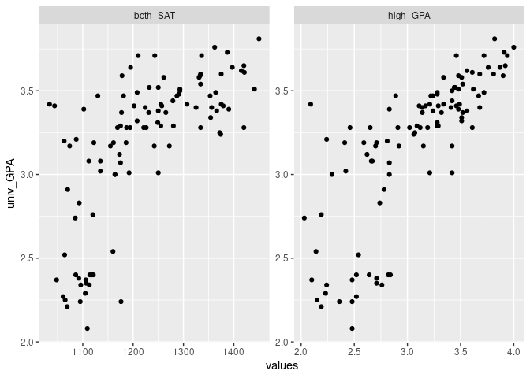
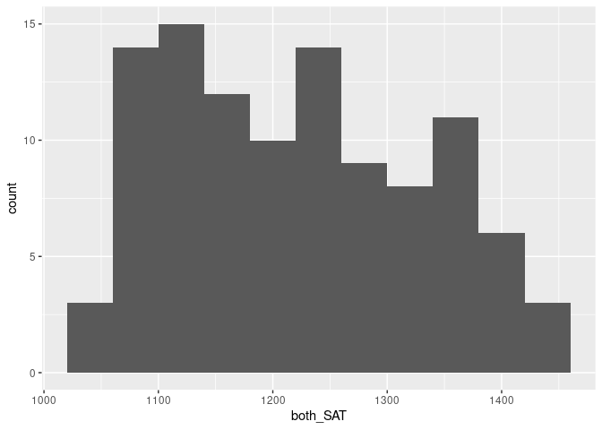
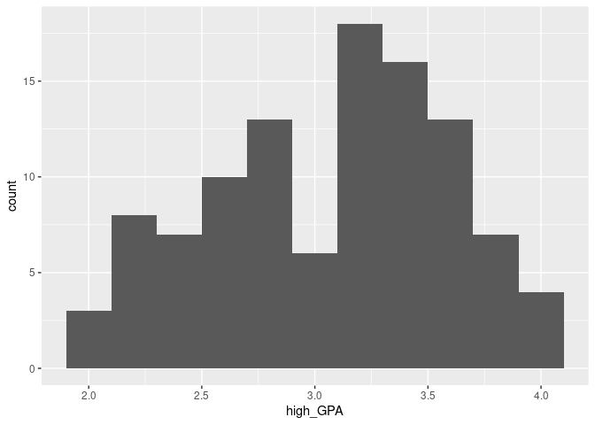
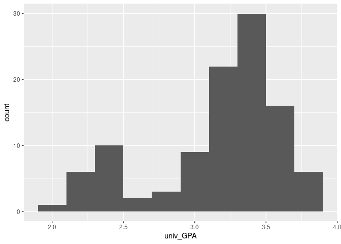
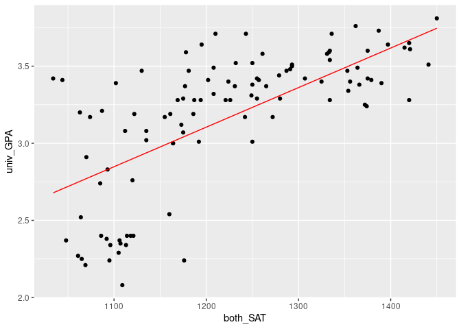
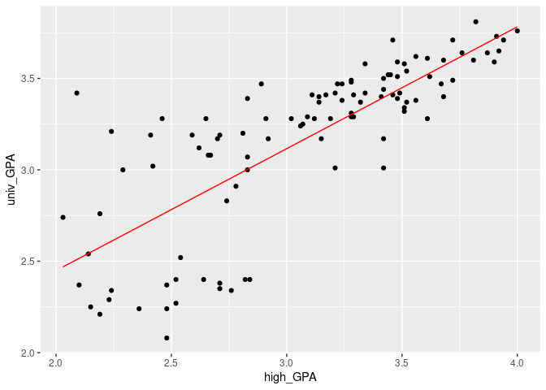

SAT and College Grades
================
Kate McCurley
20230-04-18

- <a href="#grading-rubric" id="toc-grading-rubric">Grading Rubric</a>
  - <a href="#individual" id="toc-individual">Individual</a>
  - <a href="#due-date" id="toc-due-date">Due Date</a>
- <a href="#obtain-the-data" id="toc-obtain-the-data">Obtain the Data</a>
  - <a
    href="#q1-visit-the-sat-and-college-gpa-case-study-page-scroll-to-the-bottom-and-click-the-open-data-with-excel-button-this-will-allow-you-to-download-an-xls-file-save-the-file-to-your-data-folder-load-the-data-as-df_sat-and-perform-your-first-checks-against-these-data-answer-the-questions-below"
    id="toc-q1-visit-the-sat-and-college-gpa-case-study-page-scroll-to-the-bottom-and-click-the-open-data-with-excel-button-this-will-allow-you-to-download-an-xls-file-save-the-file-to-your-data-folder-load-the-data-as-df_sat-and-perform-your-first-checks-against-these-data-answer-the-questions-below"><strong>q1</strong>
    Visit the SAT and College GPA case study page, scroll to the bottom, and
    click the <code>Open Data with Excel</code> button. This will allow you
    to download an <code>xls</code> file. Save the file to your
    <code>data</code> folder, load the data as <code>df_sat</code>, and
    perform your “first checks” against these data. Answer the questions
    below:</a>
- <a href="#analysis-with-hypothesis-testing"
  id="toc-analysis-with-hypothesis-testing">Analysis with Hypothesis
  Testing</a>
  - <a href="#view-1-correlations" id="toc-view-1-correlations">View 1:
    Correlations</a>
    - <a
      href="#q2-create-a-single-plot-that-shows-univ_gpa-against-both-high_gpa-and-both_sat-visually-compare-the-two-trends"
      id="toc-q2-create-a-single-plot-that-shows-univ_gpa-against-both-high_gpa-and-both_sat-visually-compare-the-two-trends"><strong>q2</strong>
      Create a <em>single</em> plot that shows <code>univ_GPA</code> against
      <em>both</em> <code>high_GPA</code> and <code>both_SAT</code>. Visually
      compare the two trends.</a>
    - <a href="#hypothesis-testing-with-a-correlation-coefficient"
      id="toc-hypothesis-testing-with-a-correlation-coefficient">Hypothesis
      Testing with a Correlation Coefficient</a>
    - <a
      href="#q3-plot-histograms-for-both_sat-high_gpa-univ_gpa-whichif-anyof-the-variables-look-approximately-normally-distributed"
      id="toc-q3-plot-histograms-for-both_sat-high_gpa-univ_gpa-whichif-anyof-the-variables-look-approximately-normally-distributed"><strong>q3</strong>
      Plot histograms for <code>both_SAT, high_GPA, univ_GPA</code>. Which—if
      any—of the variables look approximately normally distributed.</a>
    - <a
      href="#q4-use-the-function-cortest-to-construct-confidence-intervals-for-corrhigh_gpa-univ_gpa-and-corrboth_sat-univ_gpa-answer-the-questions-below"
      id="toc-q4-use-the-function-cortest-to-construct-confidence-intervals-for-corrhigh_gpa-univ_gpa-and-corrboth_sat-univ_gpa-answer-the-questions-below"><strong>q4</strong>
      Use the function <code>cor.test()</code> to construct confidence
      intervals for <code>corr[high_GPA, univ_GPA</code> and
      <code>corr[both_SAT, univ_GPA]</code>. Answer the questions below.</a>
    - <a
      href="#q5-use-the-bootstrap-to-approximate-a-confidence-interval-for-corrhigh_gpa-univ_gpa-compare-your-resultsboth-the-estimate-and-confidence-intervalto-your-results-from-q4"
      id="toc-q5-use-the-bootstrap-to-approximate-a-confidence-interval-for-corrhigh_gpa-univ_gpa-compare-your-resultsboth-the-estimate-and-confidence-intervalto-your-results-from-q4"><strong>q5</strong>
      Use the bootstrap to approximate a confidence interval for
      <code>corr[high_GPA, univ_GPA</code>. Compare your results—both the
      estimate and confidence interval—to your results from q4.</a>
  - <a href="#view-2-modeling" id="toc-view-2-modeling">View 2: Modeling</a>
    - <a href="#hypothesis-testing-with-a-model"
      id="toc-hypothesis-testing-with-a-model">Hypothesis Testing with a
      Model</a>
    - <a
      href="#q6-fit-a-linear-model-predicting-univ_gpa-with-the-predictor-both_sat-assess-the-model-to-determine-how-effective-a-predictor-both_sat-is-for-univ_gpa-interpret-the-resulting-confidence-interval-for-the-coefficient-on-both_sat"
      id="toc-q6-fit-a-linear-model-predicting-univ_gpa-with-the-predictor-both_sat-assess-the-model-to-determine-how-effective-a-predictor-both_sat-is-for-univ_gpa-interpret-the-resulting-confidence-interval-for-the-coefficient-on-both_sat"><strong>q6</strong>
      Fit a linear model predicting <code>univ_GPA</code> with the predictor
      <code>both_SAT</code>. Assess the model to determine how effective a
      predictor <code>both_SAT</code> is for <code>univ_GPA</code>. Interpret
      the resulting confidence interval for the coefficient on
      <code>both_SAT</code>.</a>
    - <a
      href="#q7-fit-a-model-predicting-univ_gpa-using-both-high_gpa-and-both_sat-compare-the-prediction-accuracy-and-hypothesis-test-results"
      id="toc-q7-fit-a-model-predicting-univ_gpa-using-both-high_gpa-and-both_sat-compare-the-prediction-accuracy-and-hypothesis-test-results"><strong>q7</strong>
      Fit a model predicting <code>univ_GPA</code> using both
      <code>high_GPA</code> and <code>both_SAT</code>. Compare the prediction
      accuracy and hypothesis test results.</a>
  - <a href="#synthesize" id="toc-synthesize">Synthesize</a>
    - <a
      href="#q8-using-the-results-from-all-previous-qs-answer-the-following-questions"
      id="toc-q8-using-the-results-from-all-previous-qs-answer-the-following-questions"><strong>q8</strong>
      Using the results from all previous q’s, answer the following
      questions.</a>
- <a href="#end-notes" id="toc-end-notes">End Notes</a>

*Purpose*: How do we apply hypothesis testing to investigating data? In
this challenge you’ll practice using hypothesis testing tools to make
sense of a dataset.

*Reading*: - [Harvard Study Says SATs Should Be Optional: Here’s
Why](https://www.csmonitor.com/USA/USA-Update/2016/0120/Harvard-study-says-SATs-should-be-optional.-Here-s-why)
(Optional); easy-to-read news article on colleges going SAT-free -
[Norm-Referenced Tests and Race-Blind
Admissions](https://cshe.berkeley.edu/publications/norm-referenced-tests-and-race-blind-admissions-case-eliminating-sat-and-act-university)
(Optional); technical report on relationship between the SAT/ACT and
non-academic factors

*Credit*: This is based on a [case
study](http://onlinestatbook.com/2/case_studies/sat.html) originally
prepared by Emily Zitek, with data collected through the research of
Thomas MacFarland.

``` r
library(tidyverse)
```

    ## ── Attaching packages ─────────────────────────────────────── tidyverse 1.3.2 ──
    ## ✔ ggplot2 3.4.0      ✔ purrr   1.0.1 
    ## ✔ tibble  3.1.8      ✔ dplyr   1.0.10
    ## ✔ tidyr   1.2.1      ✔ stringr 1.5.0 
    ## ✔ readr   2.1.3      ✔ forcats 0.5.2 
    ## ── Conflicts ────────────────────────────────────────── tidyverse_conflicts() ──
    ## ✖ dplyr::filter() masks stats::filter()
    ## ✖ dplyr::lag()    masks stats::lag()

``` r
library(readxl)
library(broom)
library(modelr)
```

    ## 
    ## Attaching package: 'modelr'
    ## 
    ## The following object is masked from 'package:broom':
    ## 
    ##     bootstrap

``` r
library(rsample)
library(Metrics)
```

    ## 
    ## Attaching package: 'Metrics'
    ## 
    ## The following objects are masked from 'package:modelr':
    ## 
    ##     mae, mape, mse, rmse

<!-- include-rubric -->

# Grading Rubric

<!-- -------------------------------------------------- -->

Unlike exercises, **challenges will be graded**. The following rubrics
define how you will be graded, both on an individual and team basis.

## Individual

<!-- ------------------------- -->

| Category    | Needs Improvement                                                                                                | Satisfactory                                                                                                               |
|-------------|------------------------------------------------------------------------------------------------------------------|----------------------------------------------------------------------------------------------------------------------------|
| Effort      | Some task **q**’s left unattempted                                                                               | All task **q**’s attempted                                                                                                 |
| Observed    | Did not document observations, or observations incorrect                                                         | Documented correct observations based on analysis                                                                          |
| Supported   | Some observations not clearly supported by analysis                                                              | All observations clearly supported by analysis (table, graph, etc.)                                                        |
| Assessed    | Observations include claims not supported by the data, or reflect a level of certainty not warranted by the data | Observations are appropriately qualified by the quality & relevance of the data and (in)conclusiveness of the support      |
| Specified   | Uses the phrase “more data are necessary” without clarification                                                  | Any statement that “more data are necessary” specifies which *specific* data are needed to answer what *specific* question |
| Code Styled | Violations of the [style guide](https://style.tidyverse.org/) hinder readability                                 | Code sufficiently close to the [style guide](https://style.tidyverse.org/)                                                 |

## Due Date

<!-- ------------------------- -->

All the deliverables stated in the rubrics above are due **at midnight**
before the day of the class discussion of the challenge. See the
[Syllabus](https://docs.google.com/document/d/1qeP6DUS8Djq_A0HMllMqsSqX3a9dbcx1/edit?usp=sharing&ouid=110386251748498665069&rtpof=true&sd=true)
for more information.

*Background*: Every year about 2 million students take the Scholastic
Aptitude Test (SAT). The exam is
[controversial](http://www.nea.org/home/73288.htm) but [extremely
consequential](https://www.csmonitor.com/2004/0518/p13s01-legn.html).
There are many claims about the SAT, but we’re going to look at just
one: Is the SAT predictive of scholastic performance in college? It
turns out this is a fairly complicated question to assess—we’ll get an
introduction to some of the complexities.

# Obtain the Data

<!-- -------------------------------------------------- -->

### **q1** Visit the [SAT and College GPA](http://onlinestatbook.com/2/case_studies/sat.html) case study page, scroll to the bottom, and click the `Open Data with Excel` button. This will allow you to download an `xls` file. Save the file to your `data` folder, load the data as `df_sat`, and perform your “first checks” against these data. Answer the questions below:

``` r
## TODO:
df_sat <- read_csv("./data/sat.csv")
```

    ## Rows: 105 Columns: 5
    ## ── Column specification ────────────────────────────────────────────────────────
    ## Delimiter: ","
    ## dbl (5): high_GPA, math_SAT, verb_SAT, comp_GPA, univ_GPA
    ## 
    ## ℹ Use `spec()` to retrieve the full column specification for this data.
    ## ℹ Specify the column types or set `show_col_types = FALSE` to quiet this message.

``` r
glimpse(df_sat)
```

    ## Rows: 105
    ## Columns: 5
    ## $ high_GPA <dbl> 3.45, 2.78, 2.52, 3.67, 3.24, 2.10, 2.82, 2.36, 2.42, 3.51, 3…
    ## $ math_SAT <dbl> 643, 558, 583, 685, 592, 562, 573, 559, 552, 617, 684, 568, 6…
    ## $ verb_SAT <dbl> 589, 512, 503, 602, 538, 486, 548, 536, 583, 591, 649, 592, 5…
    ## $ comp_GPA <dbl> 3.76, 2.87, 2.54, 3.83, 3.29, 2.64, 2.86, 2.03, 2.81, 3.41, 3…
    ## $ univ_GPA <dbl> 3.52, 2.91, 2.40, 3.47, 3.47, 2.37, 2.40, 2.24, 3.02, 3.32, 3…

``` r
## TODO: Do your "first checks"
```

**Observations**:

- Fill in the following “data dictionary”

| Column     | Meaning                     |
|------------|-----------------------------|
| `high_GPA` | high school GPA             |
| `math_SAT` | math section of SAT score   |
| `verb_SAT` | verbal section of SAT score |
| `comp_GPA` | computer science GPA in uni |
| `univ_GPA` | university GPA              |

- What information do we have about these students?
  - Their high school and college GPAs, both sections of their SAT
    score, and their CS-specific GPA in uni
- What kinds of information *do we not have* about these students?
  - What classes the student is taking or where they went to high school
- Based on these missing variables, what possible effects could be
  present in the data that we would have *no way of detecting*?
  - High school GPA is very variable on where they went to school. What
    classes they’re taking and their difficulty also has a heavy impact
    on GPA.

# Analysis with Hypothesis Testing

<!-- ----------------------------------------------------------------------- -->

We’re going to use two complementary approaches to analyze the data, the
first based on hypothesis testing of correlation coefficients, and the
second based on fitting a regression model and interpreting the
regression coefficients.

To simplify the analysis, let’s look at a composite SAT score:

``` r
## NOTE: No need to edit this
df_composite <-
  df_sat %>%
  mutate(both_SAT = math_SAT + verb_SAT)
```

## View 1: Correlations

<!-- ----------------------------------------------------------------------- -->

### **q2** Create a *single* plot that shows `univ_GPA` against *both* `high_GPA` and `both_SAT`. Visually compare the two trends.

*Hint*: One way to do this is to first *pivot* `df_composite`.

``` r
df_comp_long <-
  df_composite %>%
  pivot_longer(
    cols = c(high_GPA, both_SAT),
    names_to = "names",
    values_to = "values"
  )


df_comp_long %>%
  ggplot(aes(x = values, y = univ_GPA)) +
  geom_point() +
  facet_wrap(~names, scales = "free")
```

<!-- -->

**Observations**:

- What relationship do `univ_GPA` and `both_SAT` exhibit?
  - as both_SAT increases, univ_GPA increases
- What relationship do `univ_GPA` and `high_GPA` exhibit?
  - same as above -\> as high_GPA increases, univ_GPA increases
  - it seems like a more linear increase, whereas with both_SAT there
    seems to be very steep increase towards the start then it becomes
    closer in slope to univ_GPA

### Hypothesis Testing with a Correlation Coefficient

<!-- ------------------------- -->

We can use the idea of hypothesis testing with a correlation
coefficient. The idea is to set our null hypothesis to the case where
there is no correlation, and test to see if the data contradict that
perspective. Formally, the null (H0) and alternative (HA) hypotheses
relating to a correlation coefficient between two variables `X, Y` are:

$$\text{H0: } \text{Corr}[X, Y] = 0$$

$$\text{HA: } \text{Corr}[X, Y] \neq 0$$

The R function `cor.test` implements such a hypothesis test under the
assumption that `X, Y` are both normally distributed. First, let’s check
to see if this assumption looks reasonable for our data.

### **q3** Plot histograms for `both_SAT, high_GPA, univ_GPA`. Which—if any—of the variables look approximately normally distributed.

``` r
df_composite %>%
  ggplot(aes(x = both_SAT)) +
  geom_histogram(binwidth = 40)
```

<!-- -->

``` r
df_composite %>%
  ggplot(aes(x = high_GPA)) +
  geom_histogram(binwidth = .2)
```

<!-- -->

``` r
df_composite %>%
  ggplot(aes(x = univ_GPA)) +
  geom_histogram(binwidth = .2)
```

<!-- -->

**Observations**:

- To what extent does `both_SAT` look like a normal distribution?
  - Looks a bit skewed left
- To what extent does `high_GPA` look like a normal distribution?
  - it has two peaks with a dip in the middle, so not really
- To what extent does `univ_GPA` look like a normal distribution?
  - again has two peaks, with a larger peak on the right side

Keep in mind your findings as you complete q4.

### **q4** Use the function `cor.test()` to construct confidence intervals for `corr[high_GPA, univ_GPA` and `corr[both_SAT, univ_GPA]`. Answer the questions below.

``` r
cor.test(df_composite$high_GPA, df_composite$univ_GPA)
```

    ## 
    ##  Pearson's product-moment correlation
    ## 
    ## data:  df_composite$high_GPA and df_composite$univ_GPA
    ## t = 12.632, df = 103, p-value < 2.2e-16
    ## alternative hypothesis: true correlation is not equal to 0
    ## 95 percent confidence interval:
    ##  0.6911690 0.8449761
    ## sample estimates:
    ##       cor 
    ## 0.7795631

``` r
cor.test(df_composite$both_SAT, df_composite$univ_GPA)
```

    ## 
    ##  Pearson's product-moment correlation
    ## 
    ## data:  df_composite$both_SAT and df_composite$univ_GPA
    ## t = 9.5339, df = 103, p-value = 8.052e-16
    ## alternative hypothesis: true correlation is not equal to 0
    ## 95 percent confidence interval:
    ##  0.5674824 0.7746821
    ## sample estimates:
    ##       cor 
    ## 0.6846776

**Observations**:

- Which correlations are significantly nonzero?
  - both are significantly nonzero
- Which of `high_GPA` and `both_SAT` seems to be more strongly
  correlated with `univ_GPA`?
  - high_GPA is more strongly correlated
- How do the results here compare with the visual you created in q2?
  - they make sense - both have some correlation, but the one from
    high_GPA is stronger
- Based on these results, what can we say about the predictive
  capabilities of both `high_GPA` and `both_SAT` to predict `univ_GPA`?
  - both seem like they have some ability to predict it, but high_GPA
    does seem like a better predictor

Finally, let’s use the bootstrap to perform the same test using
*different* assumptions.

### **q5** Use the bootstrap to approximate a confidence interval for `corr[high_GPA, univ_GPA`. Compare your results—both the estimate and confidence interval—to your results from q4.

``` r
corr_high_GPA <- function(split) {
  dat <- analysis(split)
  tibble(
    term = "cor",
    estimate = cor(dat$high_GPA, dat$univ_GPA, method = "spearman")
  )
}

df_composite %>%
  bootstraps(1000) %>%
  mutate(estimates = map(splits, corr_high_GPA)) %>%
  int_pctl(estimates)
```

    ## # A tibble: 1 × 6
    ##   term  .lower .estimate .upper .alpha .method   
    ##   <chr>  <dbl>     <dbl>  <dbl>  <dbl> <chr>     
    ## 1 cor    0.755     0.830  0.892   0.05 percentile

**Observations**:

- How does your estimate from q5 compare with your estimate from q4?
  - it’s fairly similar, but the one from q5 is higher thus shows a
    stronger correlation
- How does your CI from q5 compare with your CI from q4?
  - it seems like a much smaller CI

*Aside*: When you use two different approximations to compute the same
quantity and get similar results, that’s an *encouraging sign*. Such an
outcome lends a bit more credibility to the results.

## View 2: Modeling

<!-- ------------------------- -->

Correlations are useful for relating two variables at a time. To study
the relationship among more variables we can instead use a fitted model.
Using a model, we can also help assess whether it is *worthwhile* to
measure a variable.

To begin, let’s first split the data into training and validation sets.

``` r
## NOTE: No need to edit
set.seed(101)

df_train <-
  df_composite %>%
  rowid_to_column() %>%
  slice_sample(n = 80)

df_validate <-
  df_composite %>%
  rowid_to_column() %>%
  anti_join(
    .,
    df_train,
    by = "rowid"
  )
```

### Hypothesis Testing with a Model

<!-- ------------------------- -->

We can combine the ideas of hypothesis testing with a model. Using a
model, we can express our hypotheses in terms of the model parameters.
For instance, if we were interested in whether $X$ has an affect on $Y$,
we might set up a model:

$$Y_i = \beta X_i + \epsilon_i$$

With the hypotheses:

$$\text{H0}: \beta = 0$$

$$\text{HA}: \beta \neq 0$$

In this case, we’re testing for whether $X$ has a significant effect on
$Y$. Let’s apply this idea to relating the variables `univ_GPA` and
`high_GPA`. Luckily R has built-in tools to construct a confidence
interval on the $\beta$’s in a regression \[1\]; we’ll simply use those
tools rather than do it by hand.

### **q6** Fit a linear model predicting `univ_GPA` with the predictor `both_SAT`. Assess the model to determine how effective a predictor `both_SAT` is for `univ_GPA`. Interpret the resulting confidence interval for the coefficient on `both_SAT`.

``` r
## TODO: Fit a model of univ_GPA on the predictor both_SAT
fit_basic <- lm(univ_GPA ~ both_SAT, data = df_train)

# ## NOTE: The following computes confidence intervals on regression coefficients
fit_basic %>%
  tidy(
    conf.int = TRUE,
    conf.level = 0.99
  )
```

    ## # A tibble: 2 × 7
    ##   term        estimate std.error statistic  p.value conf.low conf.high
    ##   <chr>          <dbl>     <dbl>     <dbl>    <dbl>    <dbl>     <dbl>
    ## 1 (Intercept)  0.0260   0.396       0.0655 9.48e- 1 -1.02      1.07   
    ## 2 both_SAT     0.00257  0.000322    7.97   1.08e-11  0.00172   0.00342

``` r
df_composite$pred = predict(fit_basic, df_composite)

# extra visual for the presentation
df_composite %>%
  ggplot(aes(x = both_SAT, y = univ_GPA)) +
  geom_point() +
  geom_line(aes(y = pred), color = "red")
```

<!-- -->

``` r
mean(fit_basic$residuals^2)
```

    ## [1] 0.1100883

``` r
# also extra code for the presentation to compare with high_GPA
fit_basic <- lm(univ_GPA ~ high_GPA, data = df_train)


df_composite$pred = predict(fit_basic, df_composite)

df_composite %>%
  ggplot(aes(x = high_GPA, y = univ_GPA)) +
  geom_point() +
  geom_line(aes(y = pred), color = "red")
```

<!-- -->

``` r
mean(fit_basic$residuals^2)
```

    ## [1] 0.08005839

**Observations**:

- What is the confidence interval on the coefficient of `both_SAT`? Is
  this coefficient significantly different from zero?
  - conf.low: .0017, conf.high: .0034. The coefficient is significantly
    different from zero
- By itself, how well does `both_SAT` predict `univ_GPA`?
  - somewhat but not super well

Remember from `e-model03-interp-warnings` that there are challenges with
interpreting regression coefficients! Let’s investigate that idea
further.

### **q7** Fit a model predicting `univ_GPA` using both `high_GPA` and `both_SAT`. Compare the prediction accuracy and hypothesis test results.

``` r
fit_q7 <- lm(univ_GPA ~ high_GPA + both_SAT, data = df_train)

fit_q7 %>%
  tidy(
    conf.int = TRUE,
    conf.level = 0.99
  )
```

    ## # A tibble: 3 × 7
    ##   term        estimate std.error statistic     p.value  conf.low conf.high
    ##   <chr>          <dbl>     <dbl>     <dbl>       <dbl>     <dbl>     <dbl>
    ## 1 (Intercept) 0.758     0.362         2.09 0.0397      -0.199      1.71   
    ## 2 high_GPA    0.570     0.103         5.55 0.000000396  0.299      0.842  
    ## 3 both_SAT    0.000534  0.000457      1.17 0.247       -0.000674   0.00174

``` r
mean(fit_q7$residuals^2)
```

    ## [1] 0.07866604

**Observations**:

- How well do these models perform, compared to the one you built in q6?
  - the confidence interval is much larger
  - the mean() of residuals is lower than above in q6
- What is the confidence interval on the coefficient of `both_SAT` when
  including `high_GPA` as a predictor?? Is this coefficient
  significantly different from zero?
  - the confidence interval now includes zero, so it is not
    significantly different from 0
- How do the hypothesis test results compare with the results in q6?
  - the hypothesis test results match the results from q6

## Synthesize

<!-- ------------------------- -->

Before closing, let’s synthesize a bit from the analyses above.

### **q8** Using the results from all previous q’s, answer the following questions.

**Observations**:

- Between `both_SAT` and `high_GPA`, which single variable would you
  choose to predict `univ_GPA`? Why?
  - high_GPA -\> better correlation and the linear model fits better
- Is `both_SAT` an effective predictor of `univ_GPA`? What specific
  pieces of evidence do you have in favor of `both_SAT` being effective?
  What specific pieces of evidence do you have against?
  - it’s somewhat effective but less effective than high_GPA, there is a
    non-zero correlation but there’s less confidence in it

# End Notes

<!-- ----------------------------------------------------------------------- -->

\[1\] There are also assumptions underlying this kind of testing, for
more information see this [Wiki
article](https://en.wikipedia.org/wiki/Linear_regression#Assumptions).
